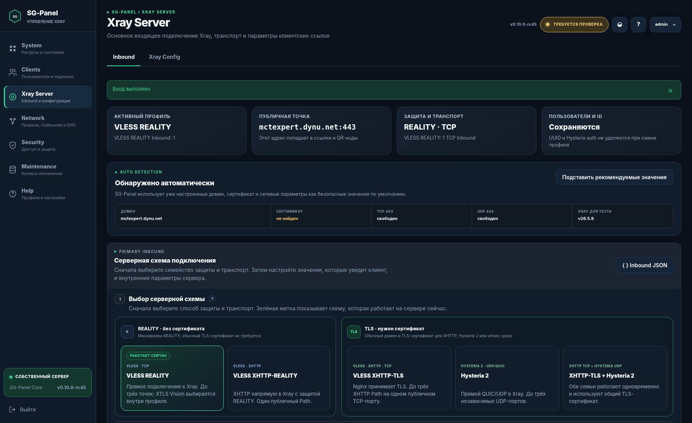
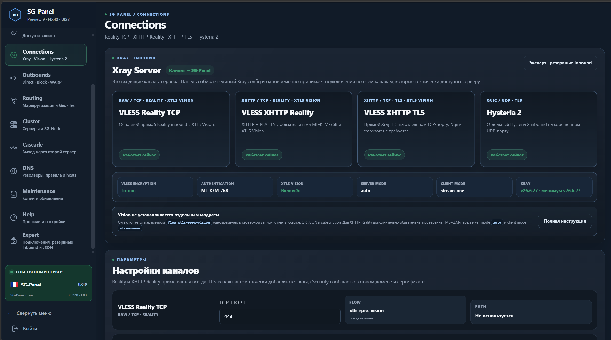
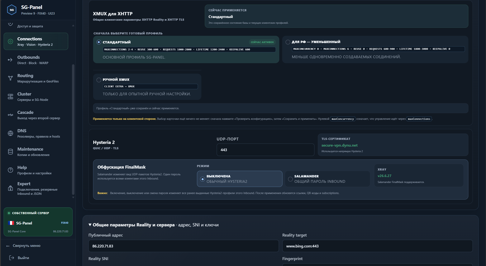
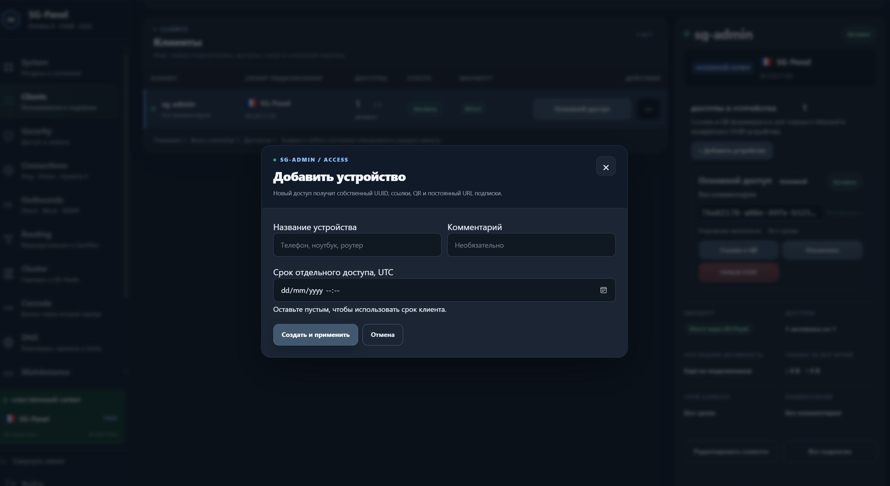
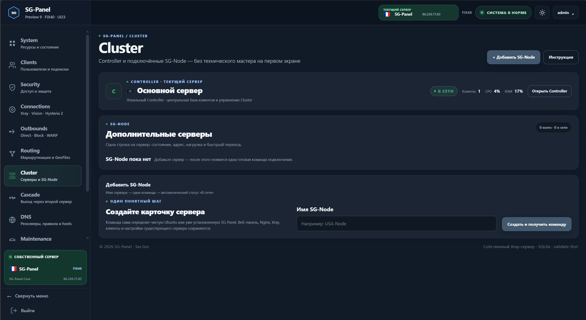
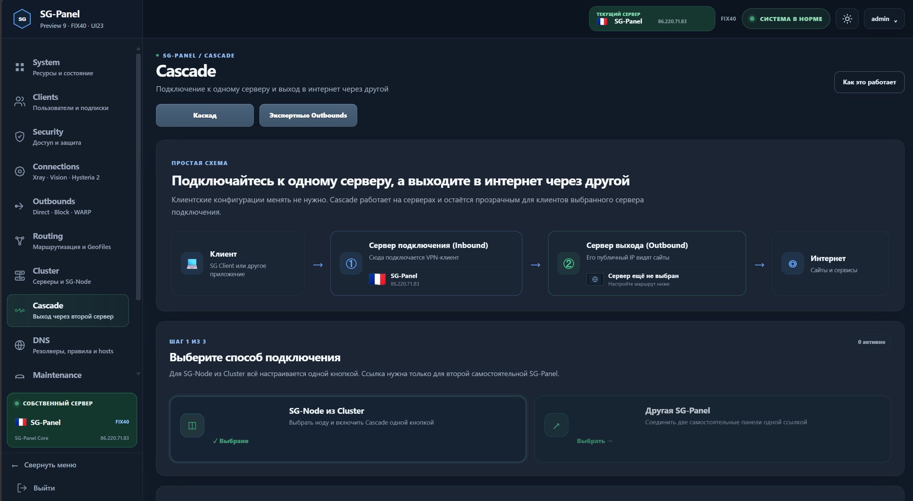
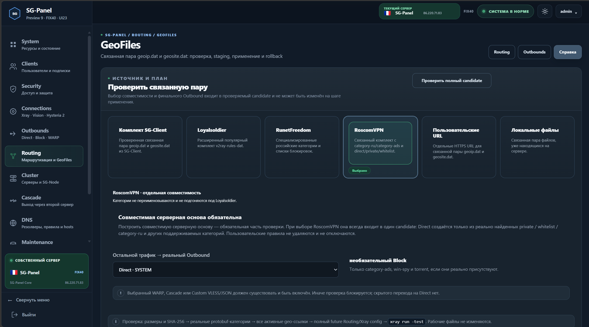
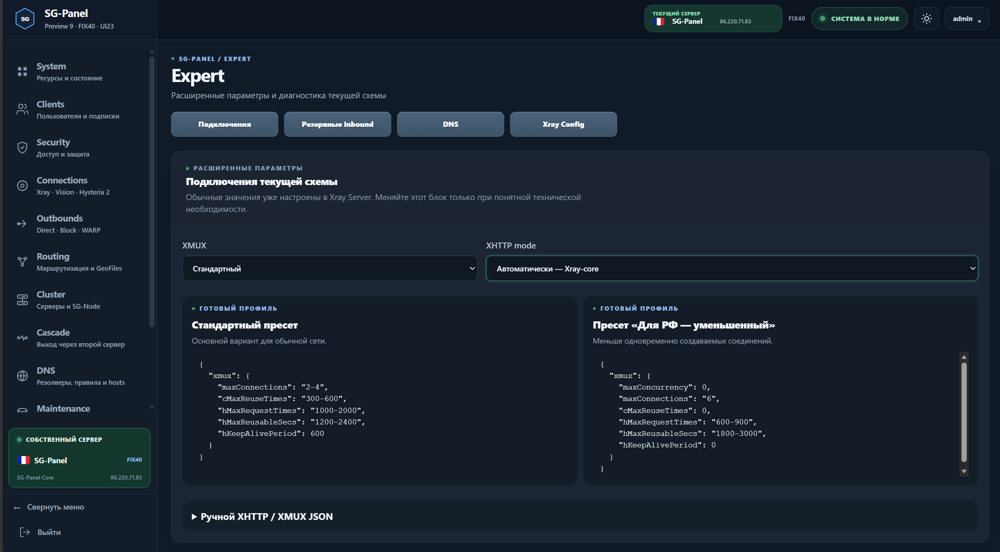
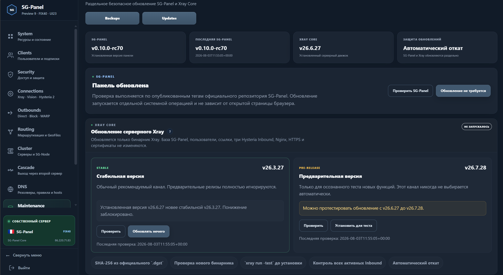

<p align="center">
  
</p>

<h1 align="center">SG-Panel</h1>

<p align="center">
  Веб-панель для установки, настройки и безопасного обслуживания собственного Xray-сервера.
</p>

<p align="center">
  
  
  
  
</p>

<p align="center">
  
</p>

> Текущая версия: **SG-Panel `v0.10.0-rc80`**.


\

<!-- RC80-PUBLICATION-START -->
## Что изменилось в RC80

### Несколько каналов вместо одного выбранного профиля

Раньше SG-Panel строила рабочую конфигурацию вокруг одного выбранного профиля. При переходе с REALITY на XHTTP или Hysteria 2 нужно было изменить активную схему и применить её заново.

Теперь используется **Always-On Xray**:

- VLESS Reality TCP и VLESS XHTTP Reality работают сразу после установки;
- после настройки домена и сертификата автоматически добавляются VLESS XHTTP TLS и Hysteria 2;
- уже работающие REALITY-подключения при этом не отключаются;
- для Reality TCP, XHTTP TLS и Hysteria 2 можно включить дополнительные Inbound.

В полной конфигурации доступны до трёх Reality TCP, один XHTTP Reality, до трёх XHTTP TLS и до трёх Hysteria 2 — всего до десяти отдельных точек подключения.

<p align="center">
  
</p>

### XMUX и Salamander

Настройки XMUX теперь находятся прямо на странице Connections и применяются к обоим Always-On XHTTP-каналам. Можно выбрать стандартный режим, уменьшенное количество соединений или задать Client Extra JSON вручную.

Каждый Hysteria 2 Inbound получил собственную настройку Salamander FinalMask. Основной, второй и третий Hysteria могут использовать разные UDP-порты, auth и пароли Salamander. Параметры автоматически попадают в ссылки, QR-коды и постоянные подписки.

<p align="center">
  
</p>

### Несколько устройств у одного клиента

Раньше для телефона, ноутбука или телевизора приходилось создавать отдельных клиентов. Теперь к одной записи клиента можно добавлять несколько устройств.

У каждого устройства собственные реквизиты подключения, ссылка, QR-код, постоянная подписка, срок действия и состояние доступа. Одно устройство можно отключить или заменить, не затрагивая остальные устройства владельца.

<p align="center">
  
</p>

### Общая клиентская база Controller и SG-Node

Клиент создаётся один раз в центральной базе Controller. Его устройства и доступы можно развернуть на одной или нескольких SG-Node без повторного создания пользователя.

Подтверждённые подключения Controller и Node входят в одну постоянную подписку. Если один сервер становится недоступен, пользователь может переключиться на другой заранее подготовленный профиль без замены UUID и повторной выдачи доступа. Для такого резерва клиент должен быть заранее развёрнут хотя бы на двух совместимых серверах.

### Cluster подключается одной командой

Подключение SG-Node переработано. Достаточно создать карточку сервера, скопировать одну команду и выполнить её на Ubuntu-сервере.

Команда сама определяет состояние машины. На чистой Ubuntu устанавливаются необходимые компоненты; при наличии полноценной SG-Panel сохраняются её Xray, Nginx, HTTPS, клиенты и веб-интерфейс, а добавляются только Agent и Worker. После подтверждённого heartbeat Node появляется в Cluster, а центральную клиентскую базу можно развернуть на ней одной операцией.

<p align="center">
  
</p>

### Cascade теперь настраивается ещё проще

Cascade и раньше настраивался через интерфейс SG-Panel, без ручного редактирования конфигурации Xray.

В RC80 процесс стал короче и понятнее.

Для каскада через Cluster достаточно выбрать подключённую SG-Node и включить Cascade. Controller сам создаёт служебное подключение, передаёт задание на Node, проверяет конфигурацию и показывает результат подключения и реальный выходной IP.

Для каскада между двумя самостоятельными SG-Panel по-прежнему используется служебная ссылка: она создаётся на выходном сервере и добавляется на входном.

То есть принцип работы не изменился — изменился сам процесс настройки. Стало меньше промежуточных действий, а состояние каскада и результат проверки теперь видны прямо в панели.

<p align="center">
  
</p>

### GeoFiles проверяются до изменения рабочих файлов

`geoip.dat` и `geosite.dat` теперь применяются как одна связанная пара. Новые файлы сначала проверяются в staging: панель читает реальные категории, сверяет их с действующими правилами Routing, строит полный будущий Xray config и запускает `xray run -test`.

Если необходимых категорий нет, применение блокируется. Пользовательские правила автоматически не удаляются и не отключаются.

<p align="center">
  
</p>

### Обычные настройки отделены от экспертных

Основные действия оставлены на обычных страницах, а резервные Inbound, ручной XMUX, DNS и полный Xray config собраны в Expert. Это позволяет работать с панелью без постоянного перехода к техническим JSON-настройкам.

<p align="center">
  
</p>

### Установка, HTTPS и обновление

Установщик теперь различает полностью установленную панель, подтверждённую незавершённую установку и посторонние файлы. Ожидание cloud-init, APT и DPKG стало видимым, а прерванную установку можно безопасно продолжить.

Предварительный вопрос о сетевых портах удалён полностью. Мастер больше не показывает список портов, не требует ответа и сразу переходит к подготовке Ubuntu.

Переход с HTTP на HTTPS отслеживается до фактического завершения. Обновления SG-Panel и Xray Core разделены, перед изменениями создаётся страховочная копия, а при ошибке выполняется автоматический rollback.

<p align="center">
  
</p>
<!-- RC80-PUBLICATION-END -->

## Что умеет SG-Panel

SG-Panel управляет собственным Xray-сервером на Ubuntu 22.04 и новее:

- Always-On Xray: VLESS Reality TCP и VLESS XHTTP Reality сразу после установки;
- автоматическое добавление VLESS XHTTP TLS и Hysteria 2 после готовности домена и сертификата;
- до трёх Reality TCP, трёх XHTTP TLS и трёх Hysteria 2 Inbound;
- Hysteria 2 Salamander FinalMask для каждого Hysteria Inbound;
- клиенты, несколько устройств у каждого клиента, QR-коды и постоянные subscriptions;
- Routing, пользовательские Outbounds, DNS и Cloudflare WARP;
- GeoFiles с staging, `xray run -test`, backup и rollback;
- Controller, SG-Node, центральная клиентская база и deployments;
- Cascade через SG-Node или вторую самостоятельную SG-Panel;
- HTTPS, резервные копии, диагностика и обновления.

Проект показывает в обычном интерфейсе только те операции, которые может сформировать, проверить, применить и восстановить при ошибке.

## Архитектура

```text
Клиент
   |
   v
Controller / SG-Panel
   |
   +-- Direct -----------------> Интернет через Controller
   +-- WARP -------------------> Интернет через Cloudflare WARP
   +-- Outbound ---------------> Другой Xray-сервер
   +-- Cascade через SG-Node --> Интернет через выбранную Node
```

Controller является источником истины для клиентов. Один клиент может иметь отдельные deployments на Controller и SG-Node без создания нового UUID/Auth.

## Hysteria2 Salamander

Salamander хранится и применяется на уровне конкретного Hysteria2 Inbound. SG-Panel:

- генерирует отдельный криптографически стойкий пароль;
- безопасно объединяет Salamander с существующим `finalmask`;
- сохраняет `quicParams`, TCP-слои и другие UDP-слои;
- проверяет минимальную версию Xray `v26.3.27`;
- строит полный candidate и запускает `xray run -test`;
- использует один URI builder для Copy, QR, downloads и subscriptions;
- не выводит пароль в обычные журналы и diagnostic bundle;
- сохраняет тот же пароль в backup/restore.

Подробный контракт: [Hysteria2 Salamander FinalMask](docs/HYSTERIA2-SALAMANDER.md).

**Граница приёмки:** код, миграция, candidate, URI, backup и rollback реализованы. Реальное внешнее подключение Hysteria2 + Salamander ещё должно быть подтверждено отдельным live-тестом.

## Cluster и SG-Node

Cluster поддерживает:

- компактный список Controller и SG-Node;
- onboarding через `+ Добавить SG-Node`;
- Agent и Worker;
- централизованные клиентские deployments;
- атомарные задания с локальным `xray run -test`, backup и rollback;
- сохранение существующего Xray-конфига Node при служебных операциях Cascade.

Версии runtime текущей базы:

```text
Agent  0.5.0
Worker 0.7.0
```

Agent сообщает Controller реальную версию Worker `0.7.0`.

Подробнее: [Cluster и SG-Node](docs/MULTI-NODE.md).

## Cascade

Два режима:

1. **SG-Node из Cluster** — выбрать online Node и включить Cascade одной кнопкой.
2. **Другая SG-Panel** — создать служебную ссылку на сервере выхода и вставить её на сервере подключения клиентов.

Controller не заменяет полный Xray config SG-Node. Worker объединяет только управляемый служебный доступ, проверяет candidate и выполняет rollback при ошибке.

Подробнее: [Cascade](docs/CASCADE.md).

## GeoFiles и Routing

GeoFiles работают парой `geoip.dat` + `geosite.dat` и поддерживают:

- встроенный комплект SG Client;
- Loyalsoldier;
- RunetFreedom;
- RoscomVPN;
- пользовательские HTTPS URL;
- загрузку или выбор локальной пары.

Полный будущий Routing и Xray config проверяются со staging до изменения live-файлов. Отсутствующие geo-категории не удаляются автоматически из пользовательских правил.

Подробнее: [Routing](docs/ROUTING.md) и [GeoFiles](docs/EXPERT-TRANSPORT-GEOFILES.md).

## Установка из GitHub

На чистой Ubuntu 22.04 или новее:

```bash
curl -fsSL https://raw.githubusercontent.com/s-gor/sg-panel/main/install-from-github.sh -o /tmp/install-sg-panel.sh
sudo bash /tmp/install-sg-panel.sh
```

Не используйте `curl | bash`: мастер задаёт начальные вопросы в интерактивном терминале.

Установщик:

1. ждёт завершения cloud-init и apt/dpkg;
2. устанавливает системные зависимости;
3. определяет публичный IPv4;
4. один раз запрашивает пароль, порт, адрес, имя сервера и Reality-параметры;
5. устанавливает SG-Panel, Xray и Nginx;
6. создаёт первый профиль;
7. проверяет службы и итоговый Xray config.

Начальная установка работает по HTTP и не требует домена или TLS-сертификата. HTTPS включается позднее из панели.

Подробности: [Установка](docs/INSTALLATION.md).

## Обновление из локального исходного дерева

В корне проверенной версии:

```bash
sudo bash install-or-upgrade.sh
```

Updater создаёт страховочную копию и при ошибке возвращает приложение, SQLite, Xray config, доступ панели и Node runtime.

## Полное удаление

```bash
sudo bash FULL-UNINSTALL-SG-PANEL.sh
```

Подробности: [Удаление](docs/UNINSTALL.md).

## Разработка и проверка

```bash
python -m pip install -r requirements.txt pytest
python -m pytest -q
python -m compileall -q xpanel tests
find . -type f -name '*.sh' -print0 | xargs -0 -n1 bash -n
```

GitHub Actions запускает тесты на Python 3.12 и 3.13.

## Структура

```text
xpanel/       приложение и веб-интерфейс
node_agent/   SG-Node Agent и Worker
deploy/       установка, обновление и обслуживание
tests/        функциональные и регрессионные тесты
docs/         пользовательская и техническая документация
assets/       встроенные GeoFiles
```

## Документация

- [Начало работы](docs/START-HERE.md)
- [Установка](docs/INSTALLATION.md)
- [Пользовательское руководство](docs/USER-GUIDE.md)
- [Clients](docs/CLIENTS.md)
- [Routing](docs/ROUTING.md)
- [Outbounds](docs/OUTBOUNDS.md)
- [Cluster и SG-Node](docs/MULTI-NODE.md)
- [Cascade](docs/CASCADE.md)
- [Hysteria2 Salamander](docs/HYSTERIA2-SALAMANDER.md)
- [Backup](docs/BACKUPS.md)
- [Diagnostics](docs/DIAGNOSTICS.md)
- [Security](docs/SECURITY.md)
- [Changelog](CHANGELOG.md)

## Текущая линия

Текущая опубликованная линия — SG-Panel v0.10.0-rc80.
