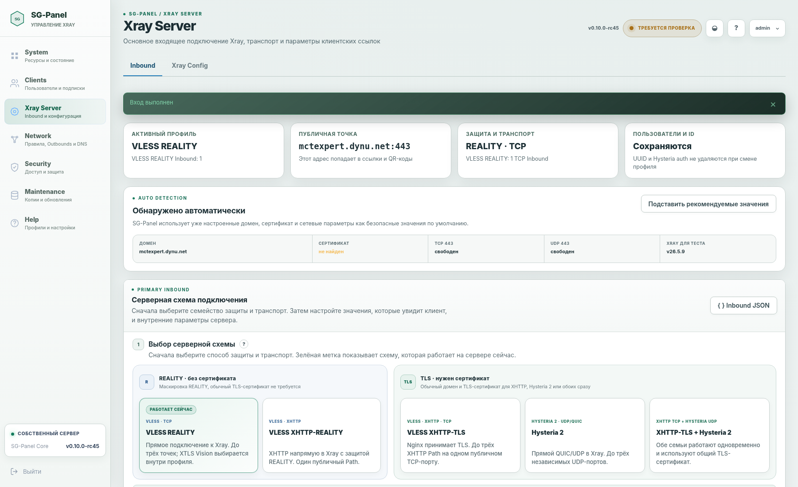

# SG-Panel v0.10.0 RC45 — Graphite / Two Themes

RC45 основан только на RC44. Релиз завершает переход к единой тёмной палитре SG Client / SG-Panel и оставляет в интерфейсе ровно два понятных режима оформления.


## Главное изменение

В панели доступны только:

- **Графит** — основная тема по умолчанию;
- **Светлая** — второй ручной режим.

Системная тема удалена. Автоматического переключения вслед за темой операционной системы или браузера больше нет.

Ранее сохранённые значения мигрируют автоматически:

| Старое значение | Тема после обновления |
|---|---|
| `system` | `graphite` |
| `dark` | `graphite` |
| неизвестное значение | `graphite` |
| `light` | `light` |

## Палитра «Графит»

Тема использует точную общую палитру SG Client / SG-Panel:

| Назначение | Цвет |
|---|---|
| общий фон | `#0B121C` |
| верхняя панель | `#0E1723` |
| боковая панель | `#101B29` |
| основные карточки | `#111D2B` |
| мягкие поверхности | `#0F1A27` |
| приподнятые элементы | `#162438` |
| поля ввода | `#0E1926` |
| обычная граница | `#24364B` |
| усиленная граница | `#34506B` |
| основной текст | `#F4F7FA` |
| вторичный текст | `#8A9AAF` |
| зелёный акцент | `#35D69A` |

Зелёный используется только для активного профиля, успешного состояния, выбранного режима, основной кнопки и коротких акцентов. Крупные поверхности не окрашиваются зелёным.

## Где применяется «Графит»

- оболочка панели;
- верхняя и боковая навигация;
- карточки и таблицы;
- формы и поля ввода;
- JSON-редакторы;
- страница входа;
- статусы, предупреждения и ошибки;
- карточки Inbound-профилей;
- состояния работающего профиля и выбранного черновика.

## Светлая тема

Светлая тема RC44 сохранена как второй рабочий вариант для пользователей, которым нужен дневной интерфейс. Она выбирается вручную и не включается автоматически.



## GitHub и документация

Для RC45 полностью обновлено публичное оформление репозитория:

- новый структурированный `README.md`;
- реальные снимки обеих тем;
- отдельное руководство `docs/THEMES.md`;
- актуальная версия документации `v0.10.0-rc45`;
- обновлённые разделы интерфейса, Help и первого входа;
- единый индекс всей документации.

## Совместимость

RC45 не меняет:

- активный профиль;
- UUID;
- REALITY-ключи;
- Short ID;
- XHTTP Path;
- Hysteria auth;
- порты;
- TLS-сертификаты;
- пользователей;
- клиентские ссылки;
- архитектуру Vision;
- установленную версию Xray.

Более новый установленный Xray не понижается.

## Проверка

Перед публикацией проверяются:

- Python-тесты;
- Python-компиляция;
- Jinja-шаблоны;
- shell-скрипты через `bash -n`;
- ссылки Markdown;
- наличие обеих тем и миграция старых значений;
- точные цвета палитры «Графит»;
- содержимое ZIP после повторной распаковки.

## Установка и обновление

Чистая установка:

```bash
sudo apt-get update && sudo apt-get install -y curl ca-certificates unzip && curl -fsSL https://raw.githubusercontent.com/s-gor/sg-panel/main/install-from-github.sh -o /tmp/install-sg-panel.sh && bash -n /tmp/install-sg-panel.sh && chmod 700 /tmp/install-sg-panel.sh && sudo bash /tmp/install-sg-panel.sh
```

На установленной панели:

```text
Maintenance → Updates → Проверить сейчас → Обновить до v0.10.0-rc45
```

После обновления браузера нажмите `Ctrl+F5`.
